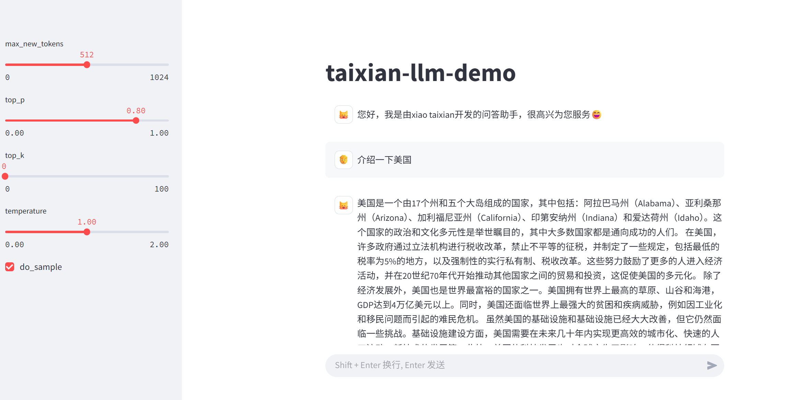

# ✨ TinyLLM‑RAG‑MOE


> A lightweight Chinese LLM with Mixture‑of‑Experts & DeepSeek‑style attention, and upcoming RAG support.

---

## 🔍 项目简介

**TinyLLM‑RAG‑MOE** 是一个小型大语言模型项目，主要面向学习大模型流程，集成：

- **MoE**：Mixture‑of‑Experts 层（4 个专家，Top‑1 路由）
- **DeepSeek‑V3 Attention**：低秩 KV 压缩（4096→400） + 解耦旋转位置编码 RoPE
- **流程**：PTM → SFT\LORA 微调 → MoE ⇢ （后续 RAG）
- **轻量化部署**：支持量化、Streamlit 演示（后续会部署到魔搭社区和 Huggingface）

  > RAG 功能正在开发中，本人也是初学者，边实践边学习边分享

## 📁 项目结构

```bash
TinyLLM-RAG-MOE/
├── data/                # 原始与预处理数据
├── img/                 # 演示
├── outputs/             # 训练及推理输出
├── quantize/            # 量化工具脚本
├── script/              # 启动与部署脚本
├── tokenizer/           # 分词器与词表
├── train/               # 训练代码与模型文件(包含Llama2版本和MOE版本)
│——— LoRA.py             #LoRA微调代码
├── utils/               # 工具函数模块
├── finetune.py          # 基本微调入口
├── llm_test.py          # 基本推理测试
├── web_demo.py          # Streamlit 演示
├── moe_test.py          # MoE测试
└── requirements.txt     # 依赖列表
```

### demo 展示



## 🚀 快速开始

### 环境依赖

```bash
pip install -r requirements.txt
```

- Python ≥3.8
- PyTorch ≥2.0
- transformers ≥4.37
- CUDA ≥11.4（如训练）

### 下载或加载模型

**Hugging Face**:

```python
from transformers import AutoTokenizer, AutoModelForCausalLM
model_id = "wdndev/tiny_llm_sft_92m"
tokenizer = AutoTokenizer.from_pretrained(model_id, trust_remote_code=True)
model = AutoModelForCausalLM.from_pretrained(model_id, device_map="auto", trust_remote_code=True)
```

**本地加载**：修改 `model_id` 为本地路径。

## 🎓 训练流程

1. **PTM**: 预训练（`train/ptm_train.py`）
2. **SFT**: 指令微调（`train/sft_train.py`）
3. **MoE**: 添加专家网络（`train/LoRA.py` 或 `train/moe_train.py`）
4. **（后续）RAG**: 检索增强生成模块

```bash
python train/sft_train.py  # SFT 微调示例
python train/LoRA.py       # LoRA+MoE 微调示例
```

## 🤖 推理与部署

- **本地 Python**: `llm_test.py` 交互测试
- **Streamlit Demo**:

  ```bash
  streamlit run web_demo.py
  ```

###### 致谢:

[wdndev](https://github.com/wdndev/tiny-llm-zh/tree/llama2_torch)、[LLama](https://github.com/meta-llama/llama)

## 🔧 未来规划

- 🌟 **RAG**：检索增强生成，集成向量检索（Milvus/FAISS） 开发 Agent
- 📈 **多卡分布式**：DeepSpeed & ZeRO 加速
- ⚙️ **更丰富评估**：加入 QA、CMMLU、C-Eval 基准测试

---

Made with ❤️ by **wdndev** | ⭐️ If you find this useful, please star!
